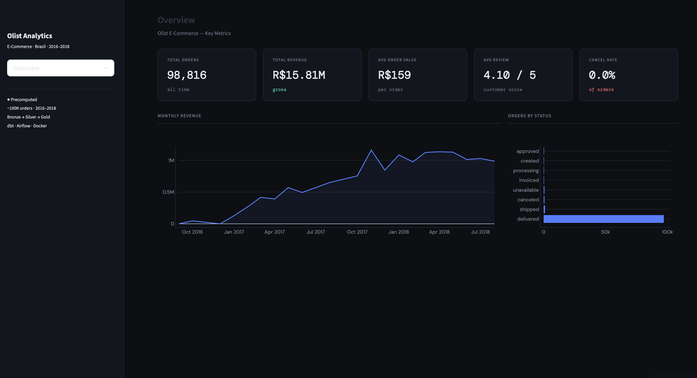
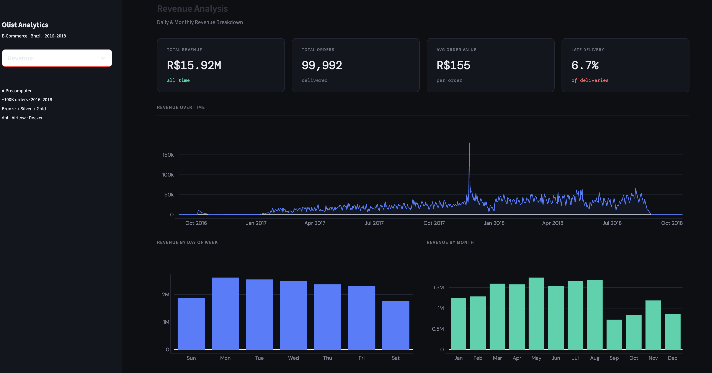
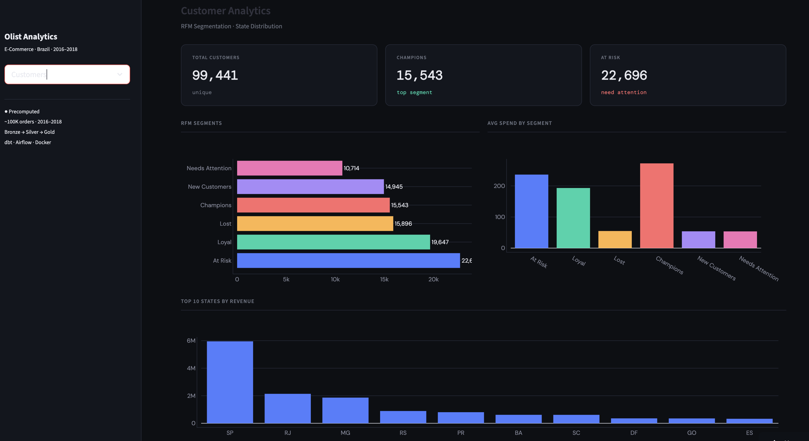
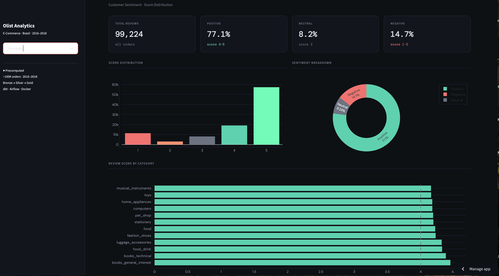
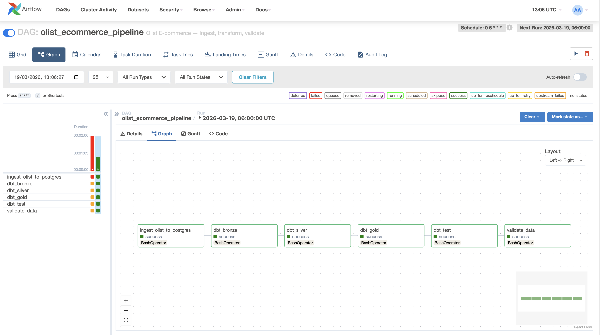
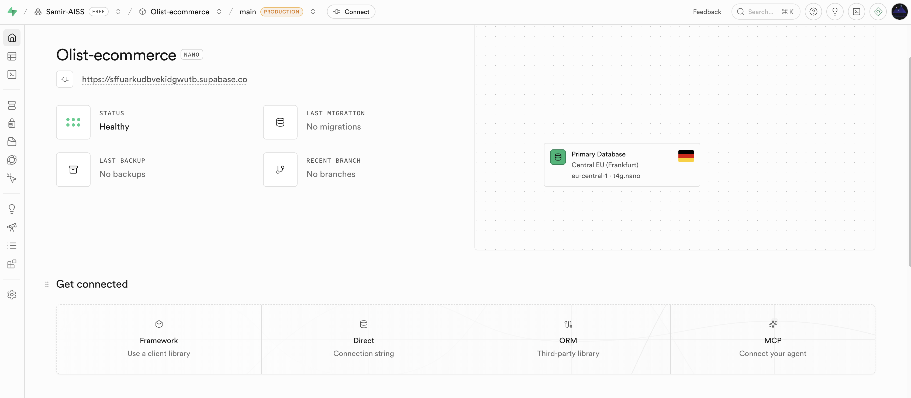

# E-Commerce Data Platform — Olist

A **production-grade data engineering pipeline** built on the [Olist Brazilian E-Commerce dataset](https://www.kaggle.com/datasets/olistbr/brazilian-ecommerce) — 100,000 real orders from 2016 to 2018. Covers end-to-end data engineering: ingestion, transformation, quality validation, cloud deployment, and BI dashboarding.

**[Live Dashboard →](https://e-commerce-data-platforme-xprnlwq65rgewbymr6nn7h.streamlit.app/)** · [Architecture](docs/architecture.md) · [Data Dictionary](docs/data_dictionary.md) · [Pipeline Guide](docs/pipeline.md) · [dbt Models](docs/dbt_models.md)

---

## Dashboard

<table>
  <tr>
    <td><br/><sub><b>Overview</b> — KPIs & Monthly Revenue</sub></td>
    <td><br/><sub><b>Revenue Analysis</b> — Daily trends & seasonality</sub></td>
  </tr>
  <tr>
    <td><br/><sub><b>Customer Analytics</b> — RFM Segmentation</sub></td>
    <td><br/><sub><b>Reviews & Satisfaction</b> — Sentiment analysis</sub></td>
  </tr>
</table>

---

## Airflow Pipeline

6 sequential tasks running daily at 6h UTC — all green ✅



| Task | Description |
|------|-------------|
| `ingest_olist_to_postgres` | Load Olist CSVs → PostgreSQL raw schema |
| `dbt_bronze` | Cleaning & type casting models |
| `dbt_silver` | Enrichment & business logic models |
| `dbt_gold` | KPI aggregations & RFM segmentation |
| `dbt_test` | dbt data quality tests |
| `validate_data` | 12 custom validation checks |

---

## Cloud Infrastructure — Supabase

PostgreSQL database hosted on Supabase (Frankfurt, EU) — stores all raw and transformed data accessible from Streamlit Cloud.



---

## Key Results

| Metric | Value |
|--------|-------|
| Orders processed | 98,816 |
| Total Revenue | R$15.81M |
| Avg Order Value | R$159 |
| Avg Review Score | 4.10 / 5 |
| dbt Models | 12 (bronze/silver/gold) |
| Validation Checks | 12 automated tests |
| Late Delivery Rate | ~8% |
| Cancel Rate | <1% |

---

## Architecture
<p align="center">
  
</p>
---

## Tech Stack

| Layer | Technology | Purpose |
|-------|-----------|---------|
| Ingestion | Python · SQLAlchemy · pandas | Load CSV → PostgreSQL |
| Storage | PostgreSQL 15 · Supabase | Raw + transformed data |
| Transformation | dbt 1.7 | Bronze → Silver → Gold models |
| Orchestration | Apache Airflow 2.8 | Daily pipeline scheduling |
| Quality | Custom validation (12 checks) | Data integrity tests |
| Infrastructure | Docker Compose | Local environment |
| Dashboard | Streamlit · Plotly | Interactive BI |
| CI/CD | GitHub Actions | Automated testing |

---

## Project Structure

```
ecommerce-data-platform/
├── .github/workflows/
│   └── Pipeline.yml          # CI/CD — GitHub Actions
├── dags/
│   └── ecommerce_pipeline.py # Airflow DAG
├── dashboard/
│   └── App.py                # Streamlit dashboard
├── dbt/
│   └── models/
│       ├── bronze/           # 6 cleaning models
│       ├── silver/           # 3 enrichment models
│       └── gold/             # 3 KPI models
├── docs/
│   ├── images/               # Screenshots
│   ├── architecture.md
│   ├── data_dictionary.md
│   ├── dbt_models.md
│   └── pipeline.md
├── ingestion/
│   ├── load_to_postgres.py
│   └── validate_data.py
├── scripts/
│   ├── export_to_pkl.py
│   └── migrate_to_supabase.py
├── docker-compose.yml
└── requirements.txt
```

---

## Quick Start

```bash
git clone https://github.com/Samir-AISS/E-commerce-data-platforme.git
cd E-commerce-data-platforme
python -m venv .venv && source .venv/bin/activate
pip install -r requirements.txt
docker-compose up -d
python ingestion/load_to_postgres.py
cd dbt && dbt run --profiles-dir .
cd .. && python ingestion/validate_data.py
streamlit run dashboard/App.py
```

Full setup guide → [docs/pipeline.md](docs/pipeline.md)

---

## Contact

**Samir EL AISSAOUY** — Data Engineer / Data Analyst

[](https://www.linkedin.com/in/samir-el-aissaouy)
[](mailto:elaissaouy.samir12@gmail.com)

---
